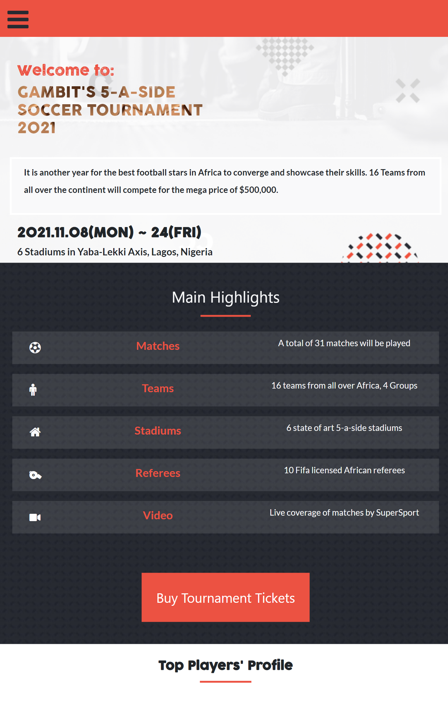

# HTML_CSS_JAVASCRIPT-PROJECT

> This Module 1 capstone projects seeks to test and put to practice my knowledge of HTML, CSS and JavaScript which I learned throughout the module.

- There are two pages; The Home Page and The About Page 

- The project has both mobile and desktop view.

- Some sections of the project have a grid view in column for mobile and a grid view in rows for desktop.

- The project has a navigation menu button (hamburger button) that opens a menu that contains links to different parts of the project. 

- Both the Home and About Pages have a fixed navigation bar in desktop view

- The Top Players's section for bothwas created dynamically using JavaScript

- More details about the project can be seen in this [video](https://www.loom.com/share/121e36323e9d4d139c96aa83ab6e8612) 

## Built With

- HTML, CSS, JavaScript
- Bootstrap
- Git, Github

## Live Demo

[Live Demo Link](https://gambit142.github.io/Html-Css-javaScript-Capstone/)

## Getting Started

### To get a local copy up and running follow these simple example steps below:

1. Copy this website **``https://github.com/Gambit142/Mobile-Version.git``**
2. Navigate to the location of the folder in your machine you wish to save this folder:
**``you@your-Pc-name:~$ cd <folder>``**
3. Clone this repository or download the Zip folder:
**``git clone https://github.com/Gambit142/Mobile-Version.git``**
4. Change Directory into the cloned repository: **``you@your-Pc-name:~$ cd <Html-Css-javaScript-Capstone>``**
5. Open the repository with Visual Code Editor: **``you@your-Pc-name:~$ code .``** or open with any code editor of your choice.

## Authors

👤 **Francis Nzenwa Ugorji**

- GitHub: [@Gambit142](https://github.com/Gambit142)
  
- LinkedIn: [Francis Ugorji](www.linkedin.com/in/francis-ugorji-a567b7168)

## 🤝 Contributing

Contributions, issues, and feature requests are welcome!

Feel free to check the [issues page](../../issues/).

## Show your sup

Give a ⭐️ if you like this project!

## Acknowledgments

- **``Microverse``** for the opportunity to underatake such project using their platform
- The original idea was that of **[Cindy Shin in Behance](https://www.behance.net/gallery/29845175/CC-Global-Summit-2015)**
- Although it is a capstone project, one of my major dream is to become a great software developer and I can only get better by undertaking such projects.
- To family and friends who motivated me throughout this project

## 📝 License

This project is [MIT](./MIT.md) licensed.
